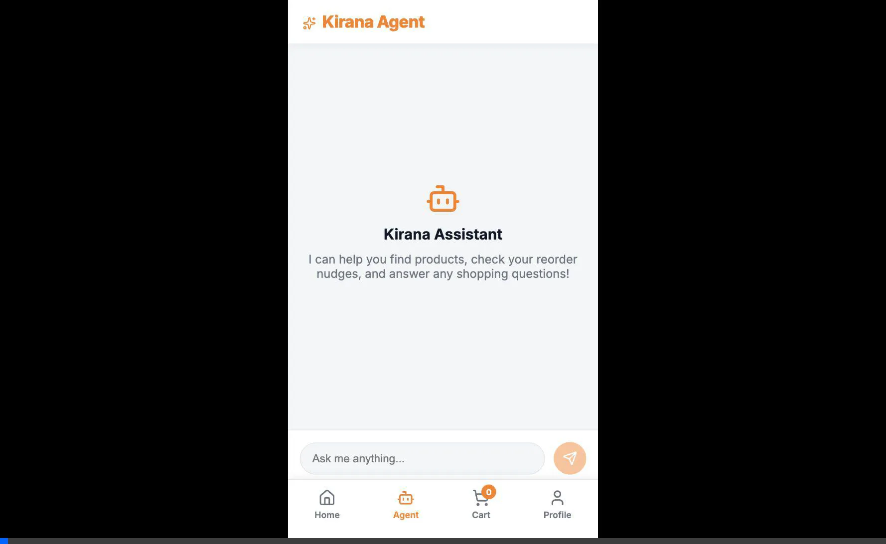

# Kirana: Your Neighbourhood Grocer, Rebuilt for AI

Kirana is a contextual household memory layer built on top of Swiggy Instamart's MVP. 
It demonstrates a powerful, proactive AI agent that understands household consumption rhythms, tracks specific life-event anomalies (like House Parties), and provides a graceful, privacy-by-design restocking experience.

## Features
- **Household Graph**: Understands different profiles (Home, Mum, Flatmate) tied to different addresses.
- **Anomaly Detection**: Suggests "Event Baskets" like House Parties when bulk orders are placed.
- **Geo-Displacement Handling**: Pauses home nudges when you're ordering from another city.
- **Conversational Interface**: A clean, Swiggy-themed AI chat that acts as a proactive virtual shopkeeper.

## Quickstart

1. Install dependencies:
   ```bash
   npm install
   ```

2. Provide your API Key in `.env.local`:
   ```bash
   OPENAI_API_KEY=your-api-key
   ```
   *(Note: The app has a built-in mock stream that simulates the demo flow even without an API key!)*

3. Run the development server:
   ```bash
   npm run dev
   ```

4. Navigate to `http://localhost:3000/agent` to interact with Kirana!

## Demo
Here is a screen recording of the Kirana Agent natively handling user requests like creating House Party event baskets and handling Geo-displacement:


